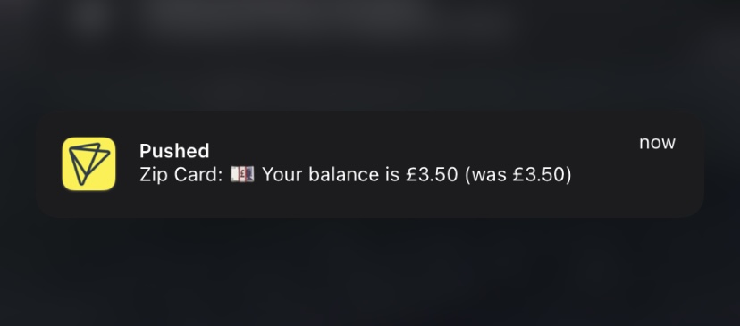

# photocard-balance

TfL Photocard push notifications



Making use of [pushed.co](https://pushed.co) and [photocard](https://github.com/oskarzyg/photocard).

## Deployment

I'm using a modified reposilite service file, so this may not be the best deployment method, but it works.

### Installation

```
git clone https://github.com/oskarzyg/photocard-balance.git
cd photocard-balance
python3 -m venv venv
source venv/bin/activate
pip install photocard pushed
deactivate
```

### Service

```
[Unit]
Description=Photocard Balance Notifier Service

[Service]
User=user
WorkingDirectory=/path/to/repository
ExecStart=/path/to/repository/venv/bin/python main.py
SuccessExitStatus=0
TimeoutStopSec=10
Restart=on-failure
RestartSec=60

Environment=PUSHED_APP_KEY=
Environment=PUSHED_APP_SECRET=
Environment=TFL_PHOTOCARD_EMAIL=
Environment=TFL_PHOTOCARD_PASSWORD=
Environment=TFL_PHOTOCARD_PERSON=
# if wanted:
# Environment=NOTIFICATON_PUSH_CARD_NUMBER=foo

[Install]
WantedBy=multi-user.target
```

### Environment Variables

* `PUSHED_APP_KEY`: Pushed App Key
* `PUSHED_APP_SECRET`: Pushed App Secret
* `TFL_PHOTOCARD_EMAIL`: Tfl Photocard Email
* `TFL_PHOTOCARD_PASSWORD`: TfL Photocard Password
* `TFL_PHOTOCARD_PERSON`: Which person to fetch cards for
* `NOTIFICATON_PUSH_CARD_NUMBER`: If present, push card number and type with notification